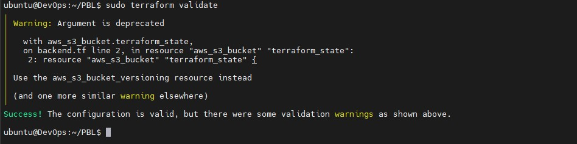
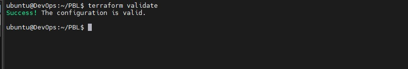
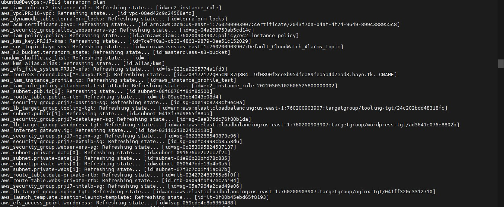
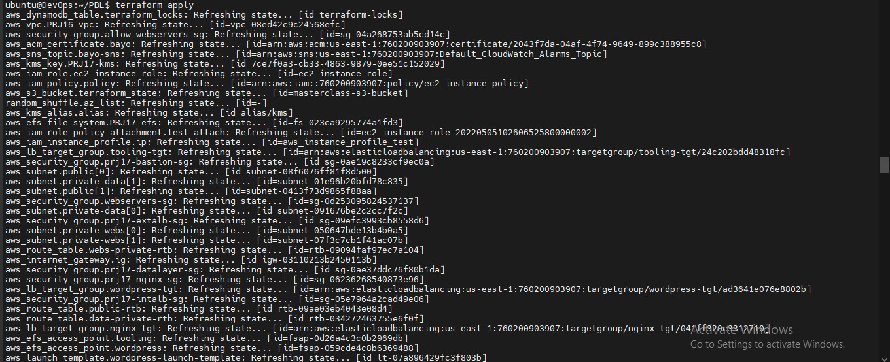

# Project 17 Automate Infrastructure With IAC using Terraform Part 2 # 

## Private Subnets ##
Create two groups of Private subnets
1. Webservers Private Subnet (one per AZ)
1. atalayer Private Subnet (one per AZ)

Make sure you use variables or *length()* function to determine the number of AZs
Use variables and *cidrsubnet()* function to allocate vpc_cidr for subnets
Keep variables and resources in separate files for better code structure and readability
Tags all the resources you have created so far. Explore how to use format() and count functions to automatically tag subnets with its respective number.

### A little bit more about Tagging ###
Tagging is a straightforward, but a very powerful concept that helps you manage your resources much more efficiently:

Resources are much better organized in ‘virtual’ groups
- They can be easily filtered and searched from console or programmatically
- Billing team can easily generate reports and determine how much each part of infrastructure costs how much (by department, by type, by environment, etc.)
- You can easily determine resources that are not being used and take actions accordingly
- If there are different teams in the organisation using the same account, tagging can help differentiate who owns which resources.

Now you can tag all you resources using the format below
~~~
tags = merge(
    var.tags,
    {
      Name = "Name of the resource"
    },
  )
~~~

NOTE: Update the variables.tf to declare the variable tags used in the format above;
~~~
variable "tags" {
  description = "A mapping of tags to assign to all resources."
  type        = map(string)
  default     = {}
}
~~~
The nice thing about this is – anytime we need to make a change to the tags, we simply do that in one single place (terraform.tfvars).

### Internet Gateways & format() function ###
Create an Internet Gateway in a separate Terraform file internet_gateway.tf
~~~
resource "aws_internet_gateway" "ig" {
  vpc_id = aws_vpc.PRJ16-vpc.id

  tags = merge(
    var.tags,
    {
      Name = format("%s-%s!", aws_vpc.main.id,"IG")
    } 
  )
}
~~~
notice how we have used format() function to dynamically generate a unique name for this resource? The first part of the %s takes the interpolated value of aws_vpc.main.id while the second %s appends a literal string IG and finally an exclamation mark is added in the end.

If any of the resources being created is either using the count function, or creating multiple resources using a loop, then a key-value pair that needs to be unique must be handled differently.

For example, each of our subnets should have a unique name in the tag section. Without the format() function, we would not be able to see uniqueness. With the format function, each private subnet’s tag will look like this.
~~~
Name = PrvateSubnet-0
Name = PrvateSubnet-1
Name = PrvateSubnet-2
Lets try and see that in action.
~~~

~~~
  tags = merge(
    var.tags,
    {
      Name = format("PrivateSubnet-%s", count.index)
    } 
  )
~~~

### NAT Gateways ###
Create 1 NAT Gateways and 1 Elastic IP (EIP) addresses

Now use similar approach to create the NAT Gateways in a new file called *natgateway.tf*.

Note: We need to create an Elastic IP for the NAT Gateway, and you can see the use of depends_on to indicate that the Internet Gateway resource must be available before this should be created. Although Terraform does a good job to manage dependencies, but in some cases, it is good to be explicit

~~~
resource "aws_eip" "prj17-nat-eip" {
  vpc        = true
  depends_on = [aws_internet_gateway.ig]

  tags = merge(
    var.tags,
    {
      Name = format("%s-EIP", var.name)
    },
  )
}

resource "aws_nat_gateway" "prj17-nat" {
  allocation_id = aws_eip.nat_eip.id
  subnet_id     = element(aws_subnet.public.*.id, 0)
  depends_on    = [aws_internet_gateway.ig]

  tags = merge(
    var.tags,
    {
      Name = format("%s-Nat", var.name)
    },
  )
}
~~~

Run to validate the codes so far
~~~
sudo terraform validate
~~~

### AWS ROUTES ###
Create a file called route_tables.tf and use it to create routes for both public and private subnets, create the below resources. Ensure they are properly tagged.

- aws_route_table
- aws_route
- aws_route_table_association

~~~
# create webserver private route table
resource "aws_route_table" "webs-private-rtb" {
  vpc_id = aws_vpc.PRJ16-vpc.id

  tags = merge(
    var.tags,
    {
      Name = format("%s-Private-Route-Table", var.name)
    },
  )
}

# associate webs private subnets to the private route table
resource "aws_route_table_association" "webs-private-subnets-assoc" {
  count          = length(aws_subnet.private-webs[*].id)
  subnet_id      = element(aws_subnet.private-webs[*].id, count.index)
  route_table_id = aws_route_table.webs-private-rtb.id
}

# create datalayer private route table
resource "aws_route_table" "data-private-rtb" {
  vpc_id = aws_vpc.PRJ16-vpc.id

  tags = merge(
    var.tags,
    {
      Name = format("%s-Private-Route-Table", var.name)
    },
  )
}

# associate data private subnets to the private route table
resource "aws_route_table_association" "data-private-subnets-assoc" {
  count          = length(aws_subnet.private-data[*].id)
  subnet_id      = element(aws_subnet.private-data[*].id, count.index)
  route_table_id = aws_route_table.data-private-rtb.id
}

# create route table for the public subnets
resource "aws_route_table" "public-rtb" {
  vpc_id = aws_vpc.PRJ16-vpc.id

  tags = merge(
    var.tags,
    {
      Name = format("%s-Public-Route-Table", var.name)
    },
  )
}
# create route for the public route table and attach the internet gateway
resource "aws_route" "public-rtb-route" {
  route_table_id         = aws_route_table.public-rtb.id
  destination_cidr_block = "0.0.0.0/0"
  gateway_id             = aws_internet_gateway.ig.id
}

# associate all public subnets to the public route table
resource "aws_route_table_association" "public-subnets-assoc" {
  count          = length(aws_subnet.public[*].id)
  subnet_id      = element(aws_subnet.public[*].id, count.index)
  route_table_id = aws_route_table.public-rtb.id
  }
~~~
We now have:

- [x] Our main vpc
- [x] 1 Public subnets
- [x] 4 Private subnets
- [x] 1 Internet Gateway
- [x] 1 NAT Gateway
- [x] 1 EIP
- [x] 3 Route tables

### AWS Identity and Access Management ###
### IaM and Roles ###
We want to pass an IAM role to our EC2 instances to give them access to some specific resources, so we need to do the following:

1. Create AssumeRole
Assume Role uses Security Token Service (STS) API that returns a set of temporary security credentials that you can use to access AWS resources that you might not normally have access to. These temporary credentials consist of an access key ID, a secret access key, and a security token. Typically, you use AssumeRole within your account or for cross-account access.

Add the following code to a new file named roles.tf
~~~
resource "aws_iam_role" "ec2_instance_role" {
name = "ec2_instance_role"
  assume_role_policy = jsonencode({
    Version = "2012-10-17"
    Statement = [
      {
        Action = "sts:AssumeRole"
        Effect = "Allow"
        Sid    = ""
        Principal = {
          Service = "ec2.amazonaws.com"
        }
      },
    ]
  })

  tags = merge(
    var.tags,
    {
      Name = "aws assume role"
    },
  )
}
~~~
In this code we are creating AssumeRole with AssumeRole policy. It grants to an entity, in our case it is an EC2, permissions to assume the role

2. Create IAM policy for this role
This is where we need to define a required policy (i.e., permissions) according to our requirements. For example, allowing an IAM role to perform action describe applied to EC2 instances:
~~~
resource "aws_iam_policy" "policy" {
  name        = "ec2_instance_policy"
  description = "A test policy"
  policy = jsonencode({
    Version = "2012-10-17"
    Statement = [
      {
        Action = [
          "ec2:Describe*",
        ]
        Effect   = "Allow"
        Resource = "*"
      },
    ]

  })

  tags = merge(
    var.tags,
    {
      Name =  "aws assume policy"
    },
  )

}
~~~

3. Attach the Policy to the IAM Role
This is where, we will be attaching the policy which we created above, to the role we created in the first step.
~~~
    resource "aws_iam_role_policy_attachment" "test-attach" {
        role       = aws_iam_role.ec2_instance_role.name
        policy_arn = aws_iam_policy.policy.arn
    }
~~~
4. Create an Instance Profile and interpolate the IAM Role
~~~
    resource "aws_iam_instance_profile" "ip" {
        name = "aws_instance_profile_test"
        role =  aws_iam_role.ec2_instance_role.name
    }
~~~
We are pretty much done with Identity and Management part for now, let us move on and create other resources required

### CREATE SECURITY GROUPS ###
We are going to create all the security groups in a single file, then we are going to refrence this security group within each resources that needs it.

IMPORTANT:

Check out the terraform documentation for [Security group](https://registry.terraform.io/providers/hashicorp/aws/latest/docs/resources/security_group)

Check out the terraform documentation for [Security group rule](https://registry.terraform.io/providers/hashicorp/aws/latest/docs/resources/security_group_rule)

Create a file and name it security.tf, copy and paste the code below
~~~
resource "aws_security_group" "allow_webservers-sg" {
  name        = "allow_webservers-sg"
  description = "Allow webservers inbound traffic"
  vpc_id      = aws_vpc.PRJ16-vpc.id

  ingress {
    description      = "Webservers traffic from VPC"
    from_port        = 443
    to_port          = 443
    protocol         = "tcp"
    cidr_blocks      = [aws_vpc.PRJ16-vpc.cidr_block]
  }
  
  ingress {
    description      = "Webservers traffic from VPC"
    from_port        = 80
    to_port          = 80
    protocol         = "tcp"
    cidr_blocks      = [aws_vpc.PRJ16-vpc.cidr_block]
  }

  egress {
    from_port        = 0
    to_port          = 0
    protocol         = "-1"
    cidr_blocks      = ["0.0.0.0/0"]
    ipv6_cidr_blocks = ["::/0"]
  }

}

# security group for alb, to allow acess from any where for HTTP and HTTPS traffic
resource "aws_security_group" "prj17-extalb-sg" {
  name        = "prj17-extalb-sg"
  vpc_id      = aws_vpc.PRJ16-vpc.id
  description = "Allow TLS inbound traffic"

  ingress {
    description = "HTTP"
    from_port   = 80
    to_port     = 80
    protocol    = "tcp"
    cidr_blocks = ["0.0.0.0/0"]
  }

  ingress {
    description = "HTTPS"
    from_port   = 443
    to_port     = 443
    protocol    = "tcp"
    cidr_blocks = ["0.0.0.0/0"]
  }

  egress {
    from_port   = 0
    to_port     = 0
    protocol    = "-1"
    cidr_blocks = ["0.0.0.0/0"]
  }

 tags = merge(
    var.tags,
    {
      Name = "prj17-extalb-sg"
    },
  )

}

# security group for bastion, to allow access into the bastion host from you IP
resource "aws_security_group" "prj17-bastion-sg" {
  name        = "prj17-bastion-sg"
  vpc_id = aws_vpc.PRJ16-vpc.id
  description = "Allow incoming SSH connections."

  ingress {
    description = "SSH"
    from_port   = 22
    to_port     = 22
    protocol    = "tcp"
    cidr_blocks = ["0.0.0.0/0"]
  }

  egress {
    from_port   = 0
    to_port     = 0
    protocol    = "-1"
    cidr_blocks = ["0.0.0.0/0"]
  }

   tags = merge(
    var.tags,
    {
      Name = "PRJ17-Bastion-SG"
    },
  )
}

#security group for nginx reverse proxy, to allow access only from the external load balancer and bastion instance
resource "aws_security_group" "prj17-nginx-sg" {
  name   = "nginx-sg"
  vpc_id = aws_vpc.PRJ16-vpc.id

  egress {
    from_port   = 0
    to_port     = 0
    protocol    = "-1"
    cidr_blocks = ["0.0.0.0/0"]
  }

   tags = merge(
    var.tags,
    {
      Name = "prj17-nginx-SG"
    },
  )
}

resource "aws_security_group_rule" "inbound-nginx-http" {
  type                     = "ingress"
  from_port                = 443
  to_port                  = 443
  protocol                 = "tcp"
  source_security_group_id = aws_security_group.prj17-extalb-sg.id
  security_group_id        = aws_security_group.prj17-nginx-sg.id
}

resource "aws_security_group_rule" "inbound-bastion-ssh" {
  type                     = "ingress"
  from_port                = 22
  to_port                  = 22
  protocol                 = "tcp"
  source_security_group_id = aws_security_group.prj17-bastion-sg.id
  security_group_id        = aws_security_group.prj17-nginx-sg.id
}

# security group for internal alb, to have access only from nginx reverser proxy server
resource "aws_security_group" "prj17-intalb-sg" {
  name   = "prj17-intalb-sg"
  vpc_id = aws_vpc.PRJ16-vpc.id

  egress {
    from_port   = 0
    to_port     = 0
    protocol    = "-1"
    cidr_blocks = ["0.0.0.0/0"]
  }

  tags = merge(
    var.tags,
    {
      Name = "prj17-intalb-sg"
    },
  )

}

resource "aws_security_group_rule" "inbound-ialb-https" {
  type                     = "ingress"
  from_port                = 443
  to_port                  = 443
  protocol                 = "tcp"
  source_security_group_id = aws_security_group.prj17-nginx-sg.id
  security_group_id        = aws_security_group.prj17-intalb-sg.id
}

# security group for webservers, to have access only from the internal load balancer and bastion instance
resource "aws_security_group" "webserver-sg" {
  name   = "my-asg-sg"
  vpc_id = aws_vpc.PRJ16-vpc.id

  egress {
    from_port   = 0
    to_port     = 0
    protocol    = "-1"
    cidr_blocks = ["0.0.0.0/0"]
  }

  tags = merge(
    var.tags,
    {
      Name = "webserver-sg"
    },
  )

}

resource "aws_security_group_rule" "inbound-web-https" {
  type                     = "ingress"
  from_port                = 443
  to_port                  = 443
  protocol                 = "tcp"
  source_security_group_id = aws_security_group.prj17-intalb-sg.id
  security_group_id        = aws_security_group.allow_webservers-sg.id
}

resource "aws_security_group_rule" "inbound-web-ssh" {
  type                     = "ingress"
  from_port                = 22
  to_port                  = 22
  protocol                 = "tcp"
  source_security_group_id = aws_security_group.prj17-bastion-sg.id
  security_group_id        = aws_security_group.allow_webservers-sg.id
}

# security group for datalayer to alow traffic from websever on nfs and mysql port and bastiopn host on mysql port
resource "aws_security_group" "prj17-datalayer-sg" {
  name   = "prj17-datalayer-sg"
  vpc_id = aws_vpc.PRJ16-vpc.id

  egress {
    from_port   = 0
    to_port     = 0
    protocol    = "-1"
    cidr_blocks = ["0.0.0.0/0"]
  }

 tags = merge(
    var.tags,
    {
      Name = "prj17-datalayer-sg"
    },
  )
}

resource "aws_security_group_rule" "inbound-nfs-port" {
  type                     = "ingress"
  from_port                = 2049
  to_port                  = 2049
  protocol                 = "tcp"
  source_security_group_id = aws_security_group.allow_webservers-sg.id
  security_group_id        = aws_security_group.prj17-datalayer-sg.id
}

resource "aws_security_group_rule" "inbound-mysql-bastion" {
  type                     = "ingress"
  from_port                = 3306
  to_port                  = 3306
  protocol                 = "tcp"
  source_security_group_id = aws_security_group.prj17-bastion-sg.id
  security_group_id        = aws_security_group.prj17-datalayer-sg.id
}

resource "aws_security_group_rule" "inbound-mysql-webserver" {
  type                     = "ingress"
  from_port                = 3306
  to_port                  = 3306
  protocol                 = "tcp"
  source_security_group_id = aws_security_group.allow_webservers-sg.id
  security_group_id        = aws_security_group.prj17-datalayer-sg.id
}
~~~
**IMPORTANT NOTE**: We used the aws_security_group_rule to refrence another security group in a security group.

### CREATE CERTIFICATE FROM AMAZON CERIFICATE MANAGER ###
Create *cert.tf* file and add the following code snippets to it.
~~~
# The entire section create a certiface, public zone, and validate the certificate using DNS method

# Create the certificate using a wildcard for all the domains created in oyindamola.gq
resource "aws_acm_certificate" "bayo" {
  domain_name       = "*.bayo.tk"
  validation_method = "DNS"
}

# calling the hosted zone
data "aws_route53_zone" "bayo" {
  name         = "bayo.tk"
  private_zone = false
}

# selecting validation method
resource "aws_route53_record" "bayo" {
  for_each = {
    for dvo in aws_acm_certificate.bayo.domain_validation_options : dvo.domain_name => {
      name   = dvo.resource_record_name
      record = dvo.resource_record_value
      type   = dvo.resource_record_type
    }
  }

  allow_overwrite = true
  name            = each.value.name
  records         = [each.value.record]
  ttl             = 60
  type            = each.value.type
  zone_id         = data.aws_route53_zone.bayo.zone_id
}

# validate the certificate through DNS method
resource "aws_acm_certificate_validation" "bayo" {
  certificate_arn         = aws_acm_certificate.bayo.arn
  validation_record_fqdns = [for record in aws_route53_record.bayo : record.fqdn]
}

# create records for tooling
resource "aws_route53_record" "tooling" {
  zone_id = data.aws_route53_zone.bayo.zone_id
  name    = "tooling.bayo.tk"
  type    = "A"

  alias {
    name                   = aws_lb.prj17-extalb.dns_name
    zone_id                = aws_lb.prj17-extalb.zone_id
    evaluate_target_health = true
  }
}

# create records for wordpress
resource "aws_route53_record" "wordpress" {
  zone_id = data.aws_route53_zone.bayo.zone_id
  name    = "wordpress.bayo.tk"
  type    = "A"

  alias {
    name                   = aws_lb.prj17-extalb.dns_name
    zone_id                = aws_lb.prj17-extalb.zone_id
    evaluate_target_health = true
  }
}
~~~

NOTE: Read Through to change the domain name to your own domain name and every other name that needs to be changed.

Check out the terraform documentation for AWS Certifivate mangarer

### 3. Create an external (Internet facing) Application Load Balancer (ALB) ###
Create a file called *alb.tf*

First of all we will create the ALB, then we create the target group and lastly we will create the lsitener rule.

Useful Terraform Documentation, go through this documentation and understand the arguement needed for each resources:

- ALB
- ALB-target
- ALB-listener
We need to create an ALB to balance the traffic between the Instances:
~~~
resource "aws_lb" "prj17-ext-alb" {
  name     = "prj17-ext-alb"
  internal = false
  security_groups = [
    aws_security_group.prj17-ext-alb-sg.id,
  ]

  subnets = [
    aws_subnet.public[0].id,
    aws_subnet.public[1].id
  ]

   tags = merge(
    var.tags,
    {
      Name = "prj17-extalb"
    },
  )

  ip_address_type    = "ipv4"
  load_balancer_type = "application"
}
~~~

To inform our ALB to where route the traffic we need to create a Target Group to point to its targets:

~~~
resource "aws_lb_target_group" "nginx-tgt" {
  health_check {
    interval            = 10
    path                = "/healthstatus"
    protocol            = "HTTPS"
    timeout             = 5
    healthy_threshold   = 5
    unhealthy_threshold = 2
  }
  name        = "nginx-tgt"
  port        = 443
  protocol    = "HTTPS"
  target_type = "instance"
  vpc_id      = aws_vpc.PRJ16-vpc.id
}
~~~

Then we will need to create a Listner for this target Group
~~~
resource "aws_lb_listener" "nginx-listner" {
  load_balancer_arn = aws_lb.prj17-extalb.arn
  port              = 443
  protocol          = "HTTPS"
  certificate_arn   = aws_acm_certificate_validation.bayo.certificate_arn

  default_action {
    type             = "forward"
    target_group_arn = aws_lb_target_group.nginx-tgt.arn
  }
}
~~~

Add the following outputs to output.tf to print them on screen
~~~
output "alb_dns_name" {
  value = aws_lb.ext-alb.dns_name
}

output "alb_target_group_arn" {
  value = aws_lb_target_group.nginx-tgt.arn
}
~~~

## Create an Internal Application Load Balancer (ALB) ##

For the Internal Load balancer we will fOllow the same concepts with the external load balancer.
Add the code snippets inside the **alb.tf** file
~~~
# ----------------------------
#Internal Load Balancers for webservers
#---------------------------------

resource "aws_lb" "prj17-int-alb" {
  name     = "prj17-int-alb"
  internal = true
  security_groups = [
    aws_security_group.prj17-intalb-sg.id,
  ]

  subnets = [
    aws_subnet.private-webs[0].id,
    aws_subnet.private-webs[1].id,
    aws_subnet.private-data[0].id,
    aws_subnet.private-data[1].id
  ]

  tags = merge(
    var.tags,
    {
      Name = "PRJ17-int-alb"
    },
  )

  ip_address_type    = "ipv4"
  load_balancer_type = "application"
}
~~~

To inform our ALB to where route the traffic we need to create a Target Group to point to its targets:

~~~
# --- target group  for wordpress -------

resource "aws_lb_target_group" "wordpress-tgt" {
  health_check {
    interval            = 10
    path                = "/healthstatus"
    protocol            = "HTTPS"
    timeout             = 5
    healthy_threshold   = 5
    unhealthy_threshold = 2
  }

  name        = "wordpress-tgt"
  port        = 443
  protocol    = "HTTPS"
  target_type = "instance"
  vpc_id      = aws_vpc.PRJ16-vpc.id
}

# --- target group for tooling -------

resource "aws_lb_target_group" "tooling-tgt" {
  health_check {
    interval            = 10
    path                = "/healthstatus"
    protocol            = "HTTPS"
    timeout             = 5
    healthy_threshold   = 5
    unhealthy_threshold = 2
  }

  name        = "tooling-tgt"
  port        = 443
  protocol    = "HTTPS"
  target_type = "instance"
  vpc_id      = aws_vpc.PRJ16-vpc.id
}
~~~

Then we will need to create a Listner for this target Group
~~~
# For this aspect a single listener was created for the wordpress which is default,
# A rule was created to route traffic to tooling when the host header changes

resource "aws_lb_listener" "webs-listener" {
  load_balancer_arn = aws_lb.prj17-int-alb.arn
  port              = 443
  protocol          = "HTTPS"
  certificate_arn   = aws_acm_certificate_validation.bayo.certificate_arn

  default_action {
    type             = "forward"
    target_group_arn = aws_lb_target_group.wordpress-tgt.arn
  }
}

# listener rule for tooling target

resource "aws_lb_listener_rule" "tooling-listener" {
  listener_arn = aws_lb_listener.webs-listener.arn
  priority     = 99

  action {
    type             = "forward"
    target_group_arn = aws_lb_target_group.tooling-tgt.arn
  }

  condition {
    host_header {
      values = ["tooling.bayo.tk"]
    }
  }
}
~~~

### CREATING AUSTOALING GROUPS ###

This Section we will create the Auto Scaling Group (ASG)
Now we need to configure our ASG to be able to scale the EC2s out and in depending on the application traffic.

Before we start configuring an ASG, we need to create the launch template and the the AMI needed. For now we are going to use a random AMI from AWS, then in project 19, we will use Packerto create our ami.

Based on our Architetcture we need for Auto Scaling Groups for bastion, nginx, wordpress and tooling, so we will create two files; *asg-bastion-nginx.tf* will contain Launch Template and Austoscaling froup for Bastion and Nginx, then *asg-wordpress-tooling.tf* will contain Launch Template and Austoscaling group for wordpress and tooling.

Useful Terraform Documentation, go through this documentation and understand the arguement needed for each resources:

- [SNS Topics](https://registry.terraform.io/providers/hashicorp/aws/latest/docs/resources/sns_topic)
- [SNS-notification](https://registry.terraform.io/providers/hashicorp/aws/latest/docs/resources/autoscaling_notification)
- [Austoscaling](https://registry.terraform.io/providers/hashicorp/aws/latest/docs/resources/autoscaling_group)
- [Launch-template](https://registry.terraform.io/providers/hashicorp/aws/latest/docs/resources/launch_template)

Create asg-bastion-nginx.tf and paste all the code snippet below;

~~~
#### creating sns topic for all the auto scaling groups
resource "aws_sns_topic" "david-sns" {
name = "Default_CloudWatch_Alarms_Topic"
}
~~~
creating notification for all the auto scaling groups
resource "aws_autoscaling_notification" "bayo_notifications" {
  group_names = [
    aws_autoscaling_group.bastion-asg.name,
    aws_autoscaling_group.nginx-asg.name,
    aws_autoscaling_group.wordpress-asg.name,
    aws_autoscaling_group.tooling-asg.name,
  ]
  notifications = [
    "autoscaling:EC2_INSTANCE_LAUNCH",
    "autoscaling:EC2_INSTANCE_TERMINATE",
    "autoscaling:EC2_INSTANCE_LAUNCH_ERROR",
    "autoscaling:EC2_INSTANCE_TERMINATE_ERROR",
  ]

  topic_arn = aws_sns_topic.bayo-sns.arn
}
~~~

### launch template for bastion ###

~~~

Autoscaling for wordpres and toolibng will be created in a seperate file

Create *asg-wordpress-tooling.tf* and paste the following code
~~~
# launch template for wordpress

resource "aws_launch_template" "wordpress-launch-template" {
  image_id               = var.ami
  instance_type          = "t2.micro"
  vpc_security_group_ids = [aws_security_group.webservers-sg.id]

  iam_instance_profile {
    name = aws_iam_instance_profile.ip.id
  }

  key_name = var.keypair

  placement {
    availability_zone = "random_shuffle.az_list.result"
  }

  lifecycle {
    create_before_destroy = true
  }

  tag_specifications {
    resource_type = "instance"

    tags = merge(
    var.tags,
    {
      Name = "wordpress-launch-template"
    },
  )

  }

  user_data = filebase64("${path.module}/wordpress.sh")
}

# ---- Autoscaling for wordpress application

resource "aws_autoscaling_group" "wordpress-asg" {
  name                      = "wordpress-asg"
  max_size                  = 2
  min_size                  = 1
  health_check_grace_period = 300
  health_check_type         = "ELB"
  desired_capacity          = 1
  vpc_zone_identifier = [

    aws_subnet.private-webs[0].id,
    aws_subnet.private-webs[1].id
  ]

  launch_template {
    id      = aws_launch_template.wordpress-launch-template.id
    version = "$Latest"
  }
  tag {
    key                 = "Name"
    value               = "wordpress-asg"
    propagate_at_launch = true
  }
}

# attaching autoscaling group of  wordpress application to internal loadbalancer
resource "aws_autoscaling_attachment" "asg_attachment_wordpress" {
  autoscaling_group_name = aws_autoscaling_group.wordpress-asg.id
  alb_target_group_arn   = aws_lb_target_group.wordpress-tgt.arn
}

# launch template for toooling
resource "aws_launch_template" "tooling-launch-template" {
  image_id               = var.ami
  instance_type          = "t2.micro"
  vpc_security_group_ids = [aws_security_group.webservers-sg.id]

  iam_instance_profile {
    name = aws_iam_instance_profile.ip.id
  }

  key_name = var.keypair

  placement {
    availability_zone = "random_shuffle.az_list.result"
  }

  lifecycle {
    create_before_destroy = true
  }

  tag_specifications {
    resource_type = "instance"

  tags = merge(
    var.tags,
    {
      Name = "tooling-launch-template"
    },
  )

  }

  user_data = filebase64("${path.module}/tooling.sh")
}

# ---- Autoscaling for tooling -----

resource "aws_autoscaling_group" "tooling-asg" {
  name                      = "tooling-asg"
  max_size                  = 2
  min_size                  = 1
  health_check_grace_period = 300
  health_check_type         = "ELB"
  desired_capacity          = 1

  vpc_zone_identifier = [

    aws_subnet.private-webs[0].id,
    aws_subnet.private-webs[1].id
  ]

  launch_template {
    id      = aws_launch_template.tooling-launch-template.id
    version = "$Latest"
  }

  tag {
    key                 = "Name"
    value               = "tooling-launch-template"
    propagate_at_launch = true
  }
}
# attaching autoscaling group of  tooling application to internal loadbalancer
resource "aws_autoscaling_attachment" "asg_attachment_tooling" {
  autoscaling_group_name = aws_autoscaling_group.tooling-asg.id
  alb_target_group_arn   = aws_lb_target_group.tooling-tgt.arn
}
~~~

## Create Elastic File System (EFS) ##

In order to create an EFS you need to create a KMS key.

AWS Key Management Service (KMS) makes it easy to create and manage cryptographic keys and control their use across a wide range of 
AWS services and applications.

Create efs.tf file and use this code 
~~~
# create key from key management system
resource "aws_kms_key" "PRJ17-kms" {
  description = "KMS key"
  policy      = <<EOF
  {
  "Version": "2012-10-17",
  "Id": "kms-key-policy",
  "Statement": [
    {
      "Sid": "Enable IAM User Permissions",
      "Effect": "Allow",
      "Principal": { "AWS": "arn:aws:iam::${var.account_no}:user/terraform" },
      "Action": "kms:*",
      "Resource": "*"
    }
  ]
}
EOF
}

# create key alias
resource "aws_kms_alias" "alias" {
  name          = "alias/kms"
  target_key_id = aws_kms_key.PRJ17-kms.key_id
}
~~~

Next, create EFS and it's mount targets- add the following code to *efs.tf*

~~~
# set first mount target for the EFS 
resource "aws_efs_mount_target" "subnet-1" {
  file_system_id  = aws_efs_file_system.PRJ17-efs.id
  subnet_id       = aws_subnet.private-webs[0].id
  security_groups = [aws_security_group.allow_webservers-sg.id]
}

# set second mount target for the EFS 
resource "aws_efs_mount_target" "subnet-2" {
  file_system_id  = aws_efs_file_system.PRJ17-efs.id
  subnet_id       = aws_subnet.private-webs[1].id
  security_groups = [aws_security_group.allow_webservers-sg.id]
}

# create access point for wordpress
resource "aws_efs_access_point" "wordpress" {
  file_system_id = aws_efs_file_system.PRJ17-efs.id

  posix_user {
    gid = 0
    uid = 0
  }

  root_directory {
    path = "/wordpress"

    creation_info {
      owner_gid   = 0
      owner_uid   = 0
      permissions = 0755
    }

  }

}

# create access point for tooling
resource "aws_efs_access_point" "tooling" {
  file_system_id = aws_efs_file_system.PRJ17-efs.id
  posix_user {
    gid = 0
    uid = 0
  }

  root_directory {

    path = "/tooling"

    creation_info {
      owner_gid   = 0
      owner_uid   = 0
      permissions = 0755
    }

  }
}
~~~

The above adds *access points* for tooling and Wordpress to the EFS

### Create MySQL RDS ###

Create the rds.tf file, put the code below in the file

~~~
# This section will create the subnet group for the RDS  instance using the private subnet
resource "aws_db_subnet_group" "PRJ17-rds" {
  name       = "prj17-rds"
  subnet_ids = [aws_subnet.private-data[0].id, aws_subnet.private-data[1].id]

 tags = merge(
    var.tags,
    {
      Name = "PRJ17-rds"
    },
  )
}

# create the RDS instance with the subnets group
resource "aws_db_instance" "PRJ17-rds" {
  allocated_storage      = 20
  storage_type           = "gp2"
  engine                 = "mysql"
  engine_version         = "5.7"
  instance_class         = "db.t2.micro"
  db_name                = "bayodb"
  username               = var.master-username
  password               = var.master-password
  parameter_group_name   = "default.mysql5.7"
  db_subnet_group_name   = aws_db_subnet_group.PRJ17-rds.name
  skip_final_snapshot    = true
  vpc_security_group_ids = [aws_security_group.allow_webservers-sg.id]
  multi_az               = "true"
}
~~~

At this point, the *variables-tf* file should look like this:

~~~
variable "region" {
        default = "us-east-1"
    }
    
variable "vpc_cidr" {
        default = "172.16.0.0/16"
    }

variable "enable_dns_support" {
        default = "true"
    }

variable "enable_dns_hostnames" {
        default ="true" 
    }

variable "enable_classiclink" {
        default = "false"
    }

variable "enable_classiclink_dns_support" {
        default = "false"
    }
    
variable "account_no" {
  type        = number
  description = "the account number"
}

variable "master-username" {
  type        = string
  description = "RDS admin username"
}

variable "master-password" {
  type        = string
  description = "RDS master password"
}

variable "tags" {
  description = "A mapping of tags to assign to all resources."
  type        = map(string)
  default     = {}
}

variable "ami" {
  type        = string
  description = "AMI ID for the launch template"
}

variable "keypair" {
  type        = string
  description = "key pair for the instances"
}

variable "preferred_number_of_public_subnets" {
    default = 2
}

variable "preferred_number_of_private-webs_subnets" {
    default = 2
}

variable "preferred_number_of_private-data_subnets" {
    default = 2
}

~~~

Use
~~~
terraform validate
~~~
To check the validity of the codes so far

The *terraform.tfvars* file should look like this:

~~~
region = "us-east-1"

vpc_cidr = "172.16.0.0/16" 

enable_dns_support = "true" 

enable_dns_hostnames = "true"  

enable_classiclink = "false" 

enable_classiclink_dns_support = "false" 

preferred_number_of_public_subnets = 2

preferred_number_of_private-webs_subnets = 2

preferred_number_of_private-data_subnets = 2

environment = "production"

ami = "ami-0b0af3577fe5e3532"

keypair = "evops"

# Ensure to change this to your acccount number
account_no = "760200903907"

master-username = "bayo"

master-password = "bayodevops"

tags = {
  Enviroment      = "production" 
  Owner-Email     = "badedeji@gmail.com"
  Managed-By      = "Terraform"
  Billing-Account = "760200903907"
}
~~~

Run
~~~
terraform plan
~~~

to have a glimpse of the infrastructure you are building 

and when satisfied with the plan, run
~~~
terraform apply
~~~

to build the infrastructure

**Additional tasks**
1. **IP Address**: This is a means of uniquely identifying a computer host on a network. There are two versions currently in use, IPV4 and IPV6. IPV4 is a 32bit address written in dot notation like this 172.17.16.1, depending on the cidr used, a part of the address refers to the network portion while the other part describes the host part. IPV6 on the other hand is 128bit long, meaning there are 2 raise to the power of 128 (trillion trillion trillion possible addresses) It is written in hex format as against IPV4 which is written in decimal format. 00ab::45EA:1234::0A::0 
1. **Subnets**: A subnet is a logical delineation of a larger network to seperate network host for security and other network management reasons. So a big network can besub-divided into smaller ones. 10.0.0.0/24 (256 addresses) can be divided into 10.0.0.0/25 and 10.0.0.128/23 (126 addresses each)
1. **CIDR Notation**: Was invented to further extend the availability of IPV4 when it was noticed that it will be exhausted soon. It helped to cut IPV$ wastages when a network/ organisation is assigned too large IPV4 space then required under old Classful allocation method. A network that needs 20 IPs shouldn't be given a class C block (256 address) with CIDR, a /27 (30 possible addresses) can be allocated
1. **IP Routing**: IP routing is the process of moving IP packets across networks. 
1. **Internet**: The internet is the interconnection of computers worldwide. It was developed from the concept of LANs (Local Area Network) which was primarily to share resources rather than duplicate resources like printers etc. The development of TCP/IP protocol made the emmergence of the internet as we know it today easier. 
1. **Gateways**: Gatways are  devices that allow traffic to pass through from one network to the other. Routers are gateways.
1. **NAT**: Net Address Translation was designed to slow down the exhaustion of IPV4 addresses, but allowing multiple private IPV4 addresses access the internet using a single public address. All the traffic from the private IPs are represented by the public IPV4
